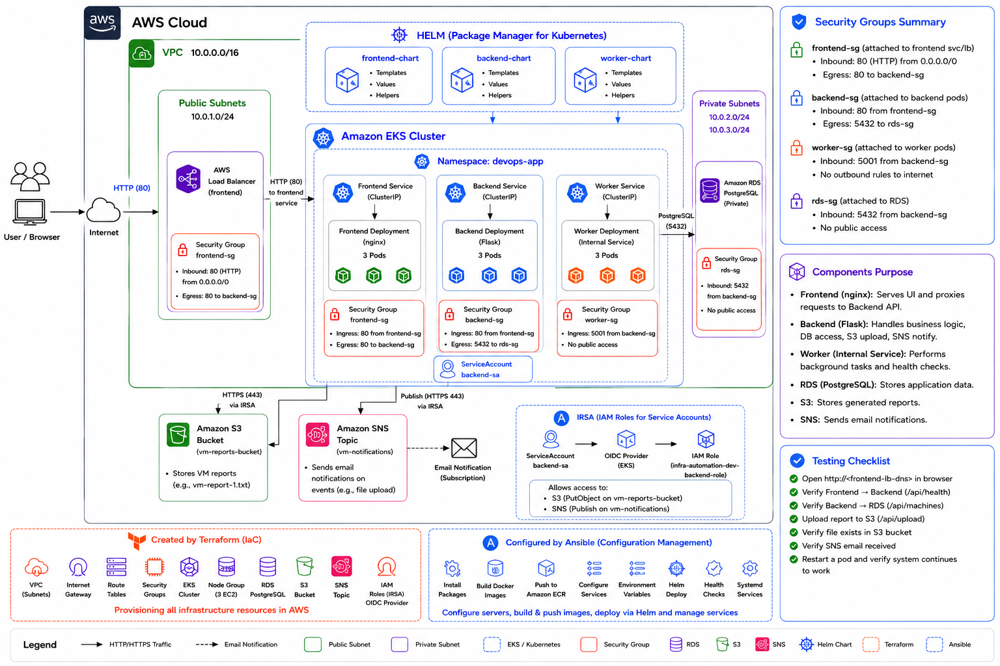

# DevOps on AWS — Kubernetes Deployment

A rolling DevOps project that extends an existing Terraform and Ansible deployment into a containerized, highly available Kubernetes architecture on Amazon EKS.

The application contains three microservices:

- **Frontend** — nginx UI and reverse proxy
- **Backend** — Flask API connected to PostgreSQL, S3, SNS, and the Worker service
- **Worker** — internal Flask service used by the Backend

The final deployment uses **Terraform, Docker, Amazon ECR, Amazon EKS, Helm, RDS PostgreSQL, S3, SNS, and IRSA**.



---

## Project highlights

- Infrastructure as Code with reusable Terraform modules
- Three-node Amazon EKS managed node group
- Three replicas of every microservice
- Pod distribution across worker nodes using topology spread constraints
- Separate Helm chart for each microservice
- Private Backend and Worker services
- Public exposure only through the Frontend LoadBalancer
- PostgreSQL hosted outside the cluster in Amazon RDS
- Secure AWS access through IAM Roles for Service Accounts (IRSA)
- Readiness and liveness probes for every workload
- CPU and memory requests and limits
- Fixed image tags stored in Amazon ECR
- End-to-end validation of RDS, S3, SNS, and inter-service communication

---

## Architecture overview

The infrastructure runs in `us-east-1` inside a dedicated VPC.

### Public path

```text
Internet
  → AWS Load Balancer
  → frontend-service
  → Frontend Pods
```

### Internal application path

```text
Frontend Pods
  → backend-service (ClusterIP)
  → Backend Pods
  → worker-service (ClusterIP)
  → Worker Pods
```

### External AWS integrations

```text
Backend Pods → Amazon RDS PostgreSQL
Backend Pods → Amazon S3
Backend Pods → Amazon SNS
Backend Pod → backend-sa → EKS OIDC Provider → IAM Role
```

Only the Frontend is exposed publicly. Backend, Worker, EKS worker nodes, and RDS remain private.

### EKS control plane

Amazon EKS manages the Kubernetes control plane. The control-plane servers do not appear as EC2 instances in the account. The account contains three EC2 worker nodes created by the EKS managed node group.

---

## Technology stack

| Technology | Purpose |
|---|---|
| Terraform | Provision AWS infrastructure |
| Ansible | Configuration management retained from Task 2 |
| Docker | Package each microservice as an image |
| Amazon ECR | Store private container images |
| Amazon EKS | Run the Kubernetes cluster |
| Helm | Package and deploy the three microservices |
| Amazon RDS for PostgreSQL | Managed application database |
| Amazon S3 | Store VM provisioning reports |
| Amazon SNS | Send report-upload notifications |
| IRSA | Grant AWS permissions to the Backend without static keys |
| nginx | Frontend web server and reverse proxy |
| Flask | Backend and Worker services |

---

## Repository structure

```text
.
├── ansible/                         # Task 2 configuration management
│   ├── inventory.example.ini
│   ├── generate_inventory.sh
│   ├── playbook.yml
│   └── roles/
├── docker/
│   ├── frontend/
│   ├── backend/
│   └── worker/
├── helm/
│   ├── frontend/
│   ├── backend/
│   └── worker/
├── k8s/
│   ├── namespace.yaml
│   └── secret.example.yaml
├── modules/
│   ├── networking/
│   ├── security_groups/
│   ├── rds_postgresql/
│   ├── s3_bucket/
│   ├── sns_topic/
│   ├── ecr/
│   ├── eks/
│   └── iam/
├── evidence/                        # Screenshots and command outputs
├── snapshots/                       # Evidence retained from Task 2
├── architecture-kubernetes.png
├── docker-compose.yml               # Local testing only
├── main.tf
├── variables.tf
├── outputs.tf
├── providers.tf
└── backend.tf
```

Local secret and state files are intentionally excluded from Git.

---

## Responsibility model

### Terraform

Terraform creates and manages:

- VPC
- Public and private subnets
- Internet Gateway and route tables
- NAT Gateway
- Security Groups
- Amazon EKS cluster
- EKS managed node group with three worker nodes
- EKS OIDC provider
- Amazon ECR repositories for Frontend, Backend, and Worker
- Amazon RDS PostgreSQL
- Amazon S3 bucket
- Amazon SNS topic
- Backend IAM role and least-privilege policy for IRSA

### Ansible

Ansible is retained from Task 2 of the rolling project. In the previous EC2 architecture it installed packages, configured nginx, deployed the services, created environment files, and managed systemd units.

In the final Kubernetes architecture, Ansible is **not** the application deployment mechanism. Docker, ECR, Helm, and EKS now perform application packaging and deployment.

### Helm

The final application deployment is performed through three separate Helm charts:

```text
helm/frontend
helm/backend
helm/worker
```

Each microservice has independent values, resources, probes, service configuration, and runtime behavior.

---

## Terraform usage

### Prerequisites

- AWS CLI configured with access to the target account
- Terraform installed
- Docker installed and running
- `kubectl` installed
- Helm installed

Create a local `terraform.tfvars` file. Do not commit it.

### Initialize

```bash
terraform init
```

### Validate

```bash
terraform fmt -recursive
terraform validate
```

### Preview

```bash
terraform plan
```

### Create the infrastructure

```bash
terraform apply
```

### View generated values

```bash
terraform output
```

Important outputs include:

- EKS cluster name and endpoint
- EKS node group name
- ECR repository URLs
- RDS endpoint
- S3 bucket name
- SNS topic ARN
- Backend IRSA role ARN

---

## Build and push container images

Authenticate Docker to Amazon ECR:

```bash
aws ecr get-login-password --region us-east-1 | \
  docker login --username AWS --password-stdin \
  904053120094.dkr.ecr.us-east-1.amazonaws.com
```

Build, tag, and push the images using the repository URLs returned by Terraform.

### Frontend

```bash
docker build -t devops-frontend:v1 docker/frontend

docker tag devops-frontend:v1 \
  904053120094.dkr.ecr.us-east-1.amazonaws.com/devops-frontend:v1

docker push \
  904053120094.dkr.ecr.us-east-1.amazonaws.com/devops-frontend:v1
```

### Backend

```bash
docker build -t devops-backend:v3 docker/backend

docker tag devops-backend:v3 \
  904053120094.dkr.ecr.us-east-1.amazonaws.com/devops-backend:v3

docker push \
  904053120094.dkr.ecr.us-east-1.amazonaws.com/devops-backend:v3
```

### Worker

```bash
docker build -t devops-worker:v1 docker/worker

docker tag devops-worker:v1 \
  904053120094.dkr.ecr.us-east-1.amazonaws.com/devops-worker:v1

docker push \
  904053120094.dkr.ecr.us-east-1.amazonaws.com/devops-worker:v1
```

The project does not use `latest` tags.

---

## Configure kubectl

```bash
aws eks update-kubeconfig \
  --region us-east-1 \
  --name "$(terraform output -raw eks_cluster_name)"
```

Verify the worker nodes:

```bash
kubectl get nodes -o wide
```

Expected result: three nodes in `Ready` state.

---

## Local Helm values and secrets

The Backend requires environment-specific values that must not be committed.

Create the local file from the example:

```bash
cp helm/backend/values.local.example.yaml \
   helm/backend/values.local.yaml
```

Replace the placeholders with values from Terraform and the local RDS password:

```yaml
serviceAccount:
  roleArn: "BACKEND_IRSA_ROLE_ARN"

config:
  awsRegion: us-east-1
  s3BucketName: "S3_BUCKET_NAME"
  snsTopicArn: "SNS_TOPIC_ARN"

secret:
  dbHost: "RDS_ENDPOINT"
  dbName: devopsdb
  dbUser: postgres
  dbPassword: "RDS_PASSWORD"
```

`values.local.yaml` is excluded through `.gitignore`.

The file `k8s/secret.example.yaml` is included only as a safe example of the Kubernetes Secret structure.

---

## Deploy the application

Create the dedicated namespace:

```bash
kubectl apply -f k8s/namespace.yaml
```

Install or upgrade the three releases:

```bash
helm upgrade --install worker helm/worker \
  --namespace devops-app

helm upgrade --install backend helm/backend \
  --namespace devops-app \
  -f helm/backend/values.local.yaml

helm upgrade --install frontend helm/frontend \
  --namespace devops-app
```

Check the releases:

```bash
helm list -n devops-app
```

The application is deployed through Helm. The `k8s/` directory is not a second full deployment method; it contains only the shared Namespace and a safe Secret example.

---

## Kubernetes resources

### Namespace

All application workloads run in:

```text
devops-app
```

The default namespace is not used.

### Deployments and replicas

| Deployment | Replicas | Purpose |
|---|---:|---|
| frontend | 3 | nginx UI and reverse proxy |
| backend | 3 | Flask API and AWS integrations |
| worker | 3 | Internal worker service |

### Services

| Service | Type | Exposure |
|---|---|---|
| frontend-service | LoadBalancer | Public |
| backend-service | ClusterIP | Internal only |
| worker-service | ClusterIP | Internal only |

No Ingress resource is implemented. The assignment allows either Ingress or a Service of type `LoadBalancer`; this project uses the latter.

### ConfigMap

The Backend ConfigMap contains non-sensitive values:

- AWS region
- RDS port
- S3 bucket name
- SNS topic ARN
- Worker service URL

### Secret

The Backend Secret contains:

- RDS endpoint
- Database name
- Database username
- Database password

The real values are supplied through the ignored `values.local.yaml` file.

### ServiceAccounts

Separate ServiceAccounts are created for:

- Frontend
- Backend
- Worker

Only `backend-sa` is connected to an AWS IAM role through IRSA.

---

## High availability and self-healing

The cluster uses three worker nodes and every application Deployment runs three replicas.

Each chart includes a topology spread constraint based on:

```text
kubernetes.io/hostname
```

With `maxSkew: 1` and `DoNotSchedule`, Kubernetes distributes replicas across the nodes instead of placing all replicas of a service on the same node.

This provides:

- One replica of each service per worker node when all nodes are available
- Continued service availability during a single-node failure
- Kubernetes self-healing when a Pod is deleted or fails
- Reduced recovery time compared with a single-replica deployment

Deployments are used instead of DaemonSets because the application requires scalable, rolling-update-capable workloads rather than a system agent that must run exactly once on every node.

---

## Health checks and resources

Every Deployment defines:

- Readiness probe
- Liveness probe
- CPU request
- Memory request
- CPU limit
- Memory limit

Health endpoints:

```text
Backend: /health
Worker:  /health
Frontend: /
```

A Pod receives traffic only after its readiness probe succeeds. Kubernetes restarts a container when its liveness probe repeatedly fails.

---

## Security

### Network exposure

- Only `frontend-service` is public.
- Backend and Worker use internal ClusterIP services.
- Worker nodes run in private subnets.
- RDS is private and is not publicly accessible.
- The RDS Security Group permits PostgreSQL traffic only from the EKS cluster security group.

### IRSA

The Backend accesses S3 and SNS through IAM Roles for Service Accounts.

The trust chain is:

```text
Backend Pod
  → backend-sa
  → EKS projected web identity token
  → EKS OIDC provider
  → Backend IAM role
  → AWS STS AssumeRoleWithWebIdentity
```

No AWS access keys are stored in Kubernetes Secrets, container images, or application source code.

The Backend IAM policy permits only:

- `s3:PutObject` on the project bucket objects
- `sns:Publish` on the project topic

Frontend and Worker do not receive these AWS permissions.

### Container security

Backend and Worker:

- Run as a non-root user
- Disable privilege escalation
- Drop all Linux capabilities

Frontend:

- Disables privilege escalation

The current nginx image listens on port 80. A future hardening improvement would use an unprivileged nginx image on port 8080 and enforce a non-root user and dropped capabilities.

### Secret management

The following local files are excluded from Git:

```text
.env
terraform.tfvars
terraform.tfstate
terraform.tfstate.*
ansible/secrets.yml
ansible/inventory.ini
helm/backend/values.local.yaml
*.pem
```

Only example files with placeholders are committed.

### RBAC and NetworkPolicy

No application Role or RoleBinding is required because the application does not call the Kubernetes API. No `cluster-admin` privileges are granted.

NetworkPolicy was not implemented in the final version. Network isolation is provided through private services, subnet placement, and AWS Security Groups. A tested NetworkPolicy can be added in a future iteration.

---

## Application behavior

### Backend endpoints

```text
/health
/worker
/provision
/machines
/upload
```

The Frontend forwards `/api/*` requests to `backend-service:5000`.

### Data flow

1. A user opens the Frontend through the AWS Load Balancer.
2. nginx forwards API requests to the internal Backend service.
3. `/provision` writes a machine record to Amazon RDS PostgreSQL.
4. `/machines` reads machine records from RDS.
5. `/worker` checks the internal Worker health endpoint.
6. `/upload` reads the latest machine record, uploads a report to S3, and publishes an SNS notification.

---

## Validation

### Required Kubernetes commands

```bash
kubectl get nodes -o wide
kubectl get namespaces
kubectl get pods -n devops-app -o wide
kubectl get deployments -n devops-app
kubectl get services -n devops-app
kubectl get ingress -n devops-app
kubectl describe pod <pod-name> -n devops-app
kubectl logs <pod-name> -n devops-app
```

`kubectl get ingress` returns no resources because external access is implemented through `frontend-service` of type `LoadBalancer`.

### Rollout status

```bash
kubectl rollout status deployment/frontend -n devops-app
kubectl rollout status deployment/backend -n devops-app
kubectl rollout status deployment/worker -n devops-app
```

### Obtain the public endpoint

```bash
LB=$(kubectl get svc frontend-service -n devops-app \
  -o jsonpath='{.status.loadBalancer.ingress[0].hostname}')

echo "$LB"
```

### HTTP and inter-service tests

```bash
curl http://$LB/
curl http://$LB/api/health
curl http://$LB/api/worker
curl http://$LB/api/machines
```

### RDS write test

```bash
curl -X POST http://$LB/api/provision \
  -H "Content-Type: application/json" \
  -d '{"name":"validation-vm","os":"ubuntu-22.04-lts","cpu":2,"ram_gb":4}'
```

Verify the record:

```bash
curl http://$LB/api/machines
```

### S3 and SNS test

```bash
curl -X POST http://$LB/api/upload
```

Verify the uploaded object:

```bash
aws s3 ls s3://$(terraform output -raw s3_bucket_name)/
```

The SNS email subscription must be confirmed manually before the notification can be received.

### IRSA verification

```bash
kubectl describe serviceaccount backend-sa -n devops-app
```

The output should include:

```text
eks.amazonaws.com/role-arn
```

Verify the projected credentials environment:

```bash
kubectl exec -n devops-app deployment/backend -- \
  sh -c 'env | grep -E "^AWS_(ROLE_ARN|WEB_IDENTITY_TOKEN_FILE|REGION|DEFAULT_REGION)"'
```

### Pod restart and self-healing

```bash
kubectl get pods -n devops-app -l app=backend
kubectl delete pod <backend-pod-name> -n devops-app
kubectl get pods -n devops-app -l app=backend -w
```

After the replacement Pod is ready:

```bash
curl http://$LB/api/health
```

---

## Manual steps

The following actions are intentionally manual and are documented:

1. Configure AWS CLI credentials locally.
2. Create `terraform.tfvars` locally.
3. Run `terraform apply`.
4. Confirm the SNS email subscription.
5. Authenticate Docker to ECR.
6. Build and push the three container images.
7. Update the local kubeconfig.
8. Create `values.local.yaml` from the provided example.
9. Install or upgrade the three Helm releases.
10. Run the validation commands.
11. Uninstall the application and destroy AWS resources after testing.

---

## Evidence

The `evidence/` directory contains screenshots and command outputs for:

- EKS cluster and node group
- Three EC2 worker nodes
- ECR repositories and image tags
- RDS, S3, SNS, and IAM
- Kubernetes nodes, namespaces, Pods, Deployments, and Services
- Helm releases and chart structure
- IRSA ServiceAccount and projected role environment
- HTTP access and inter-service communication
- RDS reads and writes
- S3 upload and SNS email notification
- Pod logs, describe output, and restart behavior
- Terraform outputs and state resource list

The `snapshots/` directory retains evidence from the previous Terraform and Ansible stage.

---

## Architectural decisions and trade-offs

### RDS outside Kubernetes

PostgreSQL remains in Amazon RDS because stateful database replication, storage, backup, failover, and recovery are better handled by a managed service for this project. Running PostgreSQL in Kubernetes would require persistent volumes and a tested replication or operator solution.

### Three separate Helm charts

Frontend, Backend, and Worker have different images, ports, resources, probes, service types, security requirements, and runtime logic. Separate charts preserve clear microservice boundaries and independent lifecycle management.

### LoadBalancer instead of Ingress

The assignment permits either Ingress or a LoadBalancer Service. A LoadBalancer was selected to keep the external path simple while exposing only the Frontend. Backend and Worker remain private.

### IRSA instead of static AWS keys

IRSA supplies temporary credentials through the EKS OIDC provider and AWS STS. This avoids long-lived access keys and permits a least-privilege role dedicated to the Backend.

### Three replicas per service

Three replicas match the three worker nodes and support high availability. Topology spread constraints prevent all replicas of one service from being scheduled on one node.

### Local Terraform state

Terraform state is currently stored locally and excluded from Git. A production environment should use a remote encrypted backend with locking, such as S3 with DynamoDB-based locking or the current supported Terraform locking mechanism.

### Flask development server

The Backend currently uses Flask's built-in server for the course environment. A production deployment should use Gunicorn or another WSGI server and move database initialization into a migration process or Kubernetes Job.

---

## Bonus features implemented

- Full Helm-based deployment
- Separate Helm chart per microservice
- IRSA on Amazon EKS
- Three-node high-availability architecture
- Topology spread constraints
- Pod self-healing validation

Not implemented in the current version:

- HPA
- PodDisruptionBudget
- TLS
- External Secrets or AWS Secrets Manager
- NetworkPolicy
- Trivy or Docker Scout scanning
- GitOps / Argo CD
- Prometheus / Grafana
- Centralized logging

---

## Future improvements

- Store application secrets in AWS Secrets Manager using External Secrets Operator
- Add TLS with AWS ACM and an AWS Load Balancer Controller or Ingress Controller
- Add Horizontal Pod Autoscalers
- Add PodDisruptionBudgets
- Add tested NetworkPolicies
- Scan images with Trivy or ECR image scanning
- Use Gunicorn for the Backend
- Add CI/CD for Docker build, ECR push, and Helm deployment
- Add Argo CD for GitOps
- Add Prometheus and Grafana monitoring
- Add centralized logging with CloudWatch or Loki
- Move Terraform state to a remote encrypted backend with locking

---

## Cleanup and cost control

Delete the Helm releases first so Kubernetes can remove the AWS Load Balancer:

```bash
helm uninstall frontend -n devops-app
helm uninstall backend -n devops-app
helm uninstall worker -n devops-app
```

Confirm that the LoadBalancer Service is gone:

```bash
kubectl get services -n devops-app
```

Delete the namespace:

```bash
kubectl delete namespace devops-app
```

Then destroy the AWS infrastructure:

```bash
terraform destroy
```

Finally verify that no billable project resources remain, especially:

- EKS cluster and node group
- EC2 worker instances
- Load Balancer
- NAT Gateway and Elastic IP
- RDS instance
- ECR repositories
- S3 bucket
- SNS topic

---

## Summary

This project demonstrates the evolution of a three-service AWS application from an EC2 and Ansible deployment into a modern Amazon EKS architecture.

Terraform provisions the infrastructure, Docker packages the services, ECR stores the images, Helm manages the Kubernetes deployment, and IRSA provides secure access to AWS services. The final system is highly available, reproducible, private by default, and documented with end-to-end operational evidence.


CI validation trigger

<!-- CI retry after agent fix -->
