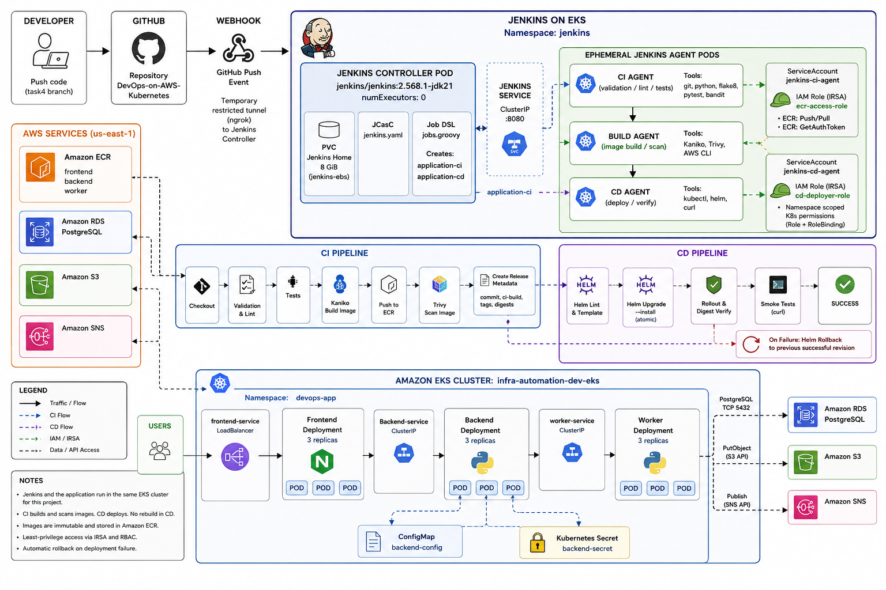
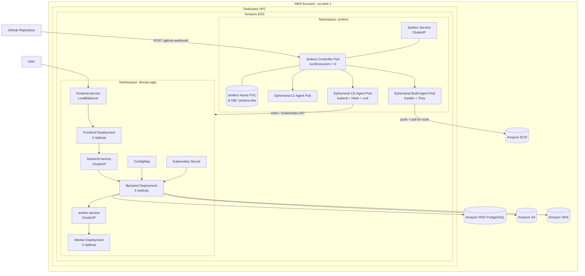
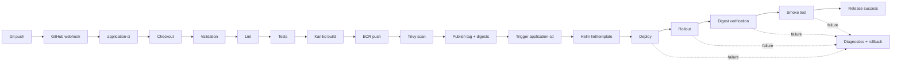

# DevOps on AWS — Jenkins CI/CD on Amazon EKS

A rolling DevOps project that evolves a three-service AWS application from EC2 and Ansible into a containerized Kubernetes platform with a reproducible Jenkins CI/CD system running inside Amazon EKS.

The final solution contains three application microservices:

- **Frontend** — nginx UI and reverse proxy
- **Backend** — Flask API connected to PostgreSQL, S3, SNS, and the Worker service
- **Worker** — internal Flask service consumed by the Backend

The delivery platform adds:

- **Jenkins Controller** running as a persistent Pod in the `jenkins` namespace
- **Ephemeral Jenkins agent Pods** for CI, image build/scan, and CD
- **Jenkins Configuration as Code (JCasC)**
- **Job DSL** for reproducible `application-ci` and `application-cd` jobs
- **Kaniko** for container image builds without mounting the node Docker socket
- **Trivy** for image vulnerability scanning
- **Amazon ECR** for immutable application images
- **Helm** for controlled application deployment
- **Kubernetes RBAC and AWS IRSA** for least-privilege access

The same Amazon EKS cluster hosts Jenkins and the application, but they are separated into dedicated namespaces and use separate identities and permissions.

---

## Project status

The Task 4 delivery path is implemented end to end:

```text
GitHub push
    ↓
GitHub webhook
    ↓
application-ci
    ↓
Validation → Lint → Tests
    ↓
Kaniko image build
    ↓
Amazon ECR
    ↓
Trivy image scan
    ↓
Release metadata: commit + tag + digests
    ↓
application-cd
    ↓
Helm validation
    ↓
Helm deployment
    ↓
Kubernetes rollout
    ↓
Image digest verification
    ↓
Smoke tests
    ↓
SUCCESS
```

The CI and CD pipelines are intentionally separate. CI never deploys the application, and CD never rebuilds an image.

The immutable image created and scanned by CI is the exact image deployed by CD.

---

## Final architecture

The infrastructure runs in `us-east-1` inside a dedicated VPC.

Jenkins and the application run in the same EKS cluster for this course environment. Namespace, ServiceAccount, IAM, and RBAC boundaries separate the CI, CD, and application responsibilities.

### Deployment view



### Pipeline flow



The diagram intentionally does **not** claim NetworkPolicies, per-Pod AWS security groups, TLS, WAF, or authentication because those controls are not implemented in the current course environment.

---

## Public and internal traffic

### Public application path

```text
Internet
  → AWS Load Balancer
  → frontend-service
  → Frontend Pods
```

### Internal application path

```text
Frontend Pods
  → backend-service (ClusterIP)
  → Backend Pods
  → worker-service (ClusterIP)
  → Worker Pods
```

### AWS integrations

```text
Backend Pod
  → backend-sa
  → EKS OIDC provider
  → IAM role through IRSA
  → Amazon S3 / Amazon SNS

Backend Pods
  → private Amazon RDS PostgreSQL
```

Only the Frontend application Service is public. Backend and Worker use ClusterIP Services, and RDS remains private.

---

## Technology stack

| Technology | Purpose |
|---|---|
| Terraform | Provision AWS infrastructure |
| Ansible | Retained from the earlier EC2-based stage |
| Amazon EKS | Host Jenkins and the Kubernetes application |
| Kubernetes | Orchestrate controller, agents, and application workloads |
| Helm | Install Jenkins and deploy the application |
| Jenkins | CI/CD automation |
| JCasC | Jenkins system configuration as code |
| Job DSL | Create Jenkins jobs reproducibly |
| Kaniko | Build container images inside Kubernetes without Docker socket mounting |
| Trivy | Scan application images for vulnerabilities |
| Amazon ECR | Store immutable private application images |
| Amazon RDS PostgreSQL | Managed application database |
| Amazon S3 | Store provisioning reports |
| Amazon SNS | Publish report-upload notifications |
| IRSA | Give Pods AWS permissions without long-lived access keys |
| nginx | Frontend web server and reverse proxy |
| Flask | Backend and Worker services |

---

## Repository structure

```text
.
├── Jenkinsfile-ci
├── Jenkinsfile-cd
├── README.md
│
├── ansible/                         # Previous EC2/Ansible project stage
│
├── docker/
│   ├── frontend/
│   ├── backend/
│   └── worker/
│
├── helm/
│   ├── frontend/
│   ├── backend/
│   └── worker/
│
├── jenkins/
│   ├── agents/
│   │   ├── ci-agent.yaml
│   │   ├── build-agent.yaml
│   │   └── cd-agent.yaml
│   ├── jcasc/
│   │   └── jenkins.yaml
│   ├── jobs/
│   │   └── jobs.groovy
│   ├── rbac/
│   │   ├── ci-rbac.yaml
│   │   └── cd-rbac.yaml
│   ├── storage/
│   │   └── storageclass.yaml
│   ├── ngrok-webhook-policy.yaml
│   ├── values.example.yaml
│   └── values.yaml
│
├── k8s/
│   ├── namespace.yaml
│   └── secret.example.yaml
│
├── modules/
│   ├── networking/
│   ├── security_groups/
│   ├── rds_postgresql/
│   ├── s3_bucket/
│   ├── sns_topic/
│   ├── ecr/
│   ├── eks/
│   └── iam/
│
├── scripts/
│   └── jenkins/
│       ├── install-jenkins.sh
│       ├── configure-jenkins.sh
│       ├── create-credentials.sh
│       ├── create-jobs.sh
│       ├── configure-webhook.sh
│       ├── verify-jenkins.sh
│       ├── verify-ci.sh
│       ├── verify-cd.sh
│       ├── rollback.sh
│       ├── scan-platform-images.sh
│       ├── preflight.sh
│       └── uninstall-jenkins.sh
│
├── evidence/
├── snapshots/
├── main.tf
├── variables.tf
├── outputs.tf
├── providers.tf
└── backend.tf
```

Local secrets, state files, generated credentials, and environment-specific values are intentionally excluded from Git.

---

# Infrastructure

## Terraform responsibility

Terraform provisions and manages the AWS infrastructure required by the project, including:

- VPC
- Public and private subnets
- Internet Gateway and routing
- NAT Gateway
- Security Groups
- Amazon EKS cluster
- EKS managed node group
- EKS OIDC provider
- Amazon ECR repositories
- Amazon RDS PostgreSQL
- Amazon S3 bucket
- Amazon SNS topic
- Backend application IRSA role
- Jenkins CI IRSA role and ECR permissions

The course configuration favors cost control and reproducibility over full production resilience.

---

## Terraform prerequisites

Required locally:

- AWS CLI configured for the target AWS account
- Terraform
- `kubectl`
- Helm
- Git
- Bash / WSL
- Python 3
- Java for Jenkins CLI usage when required

Create a local `terraform.tfvars` file and do not commit it.

### Initialize

```bash
terraform init
```

### Format and validate

```bash
terraform fmt -recursive
terraform validate
```

### Preview changes

```bash
terraform plan
```

### Create infrastructure

```bash
terraform apply
```

### View outputs

```bash
terraform output
```

Important outputs include the EKS cluster name, ECR repositories, RDS endpoint, S3 bucket, SNS topic, and IAM role ARNs.

---

## Configure kubectl

```bash
aws eks update-kubeconfig \
  --region us-east-1 \
  --name "$(terraform output -raw eks_cluster_name)"
```

Verify:

```bash
kubectl get nodes -o wide
```

---

# Kubernetes application

## Namespace

Application workloads run in:

```text
devops-app
```

Jenkins runs separately in:

```text
jenkins
```

Neither the application nor Jenkins workloads are intentionally deployed into the `default` namespace.

---

## Deployments

| Deployment | Desired replicas | Purpose |
|---|---:|---|
| frontend | 3 | nginx UI and reverse proxy |
| backend | 3 | Flask API and AWS integrations |
| worker | 3 | Internal worker service |

Topology spread constraints use:

```text
kubernetes.io/hostname
```

with `maxSkew: 1` to distribute replicas across available worker nodes.

---

## Services

| Service | Type | Exposure |
|---|---|---|
| frontend-service | LoadBalancer | Public course endpoint |
| backend-service | ClusterIP | Internal |
| worker-service | ClusterIP | Internal |

No application Ingress is implemented. The Frontend is exposed directly using a Service of type `LoadBalancer`.

---

## Application configuration

The Backend receives non-sensitive configuration through a ConfigMap and sensitive database values through a Kubernetes Secret.

Non-sensitive values include:

- AWS region
- RDS port
- S3 bucket name
- SNS topic ARN
- Worker service URL

Sensitive values include:

- RDS endpoint
- database name
- database username
- database password

Environment-specific Backend Helm values are kept in:

```text
helm/backend/values.local.yaml
```

The real file is excluded from Git. A safe example is committed.

---

## Application ServiceAccounts and IRSA

Separate Kubernetes ServiceAccounts are used for Frontend, Backend, and Worker.

Only `backend-sa` receives AWS permissions through IRSA.

The trust chain is:

```text
Backend Pod
  → backend-sa
  → projected web identity token
  → EKS OIDC provider
  → backend IAM role
  → AWS STS
  → S3 / SNS
```

No static AWS access key is embedded in the application source, image, or Kubernetes manifest.

---

# Jenkins on Kubernetes

## Jenkins Controller

The Jenkins controller runs as a single persistent Pod inside the `jenkins` namespace.

Pinned controller image:

```text
jenkins/jenkins:2.568.1-jdk21
```

The controller is configured with:

```yaml
replicas: 1
numExecutors: 0
executorMode: EXCLUSIVE
```

`numExecutors: 0` is deliberate: builds and deployments must not run on the controller.

The Jenkins Service is:

```text
ClusterIP :8080
```

The UI is intended for controlled administrative access through local port-forwarding in the course environment rather than unrestricted public exposure.

Example:

```bash
kubectl port-forward -n jenkins svc/jenkins 8080:8080
```

---

## Jenkins persistent storage

Jenkins home is persisted with a PVC:

```text
StorageClass: jenkins-ebs
AccessMode:   ReadWriteOnce
Size:         8Gi
```

This preserves Jenkins home independently of controller Pod replacement.

JCasC and Job DSL remain the authoritative configuration mechanism for reproducibility.

---

## Controller hardening

The Jenkins controller is configured to:

- run as UID/GID 1000
- run as non-root
- use `seccompProfile: RuntimeDefault`
- disable privilege escalation
- drop Linux capabilities
- use a read-only root filesystem
- disable anonymous read access
- disable self-registration
- run zero build executors

Resource requests and limits are defined for both the controller and configuration reload sidecar.

---

## Jenkins plugins

Plugin versions are declared in `jenkins/values.yaml`.

The configured plugin set includes:

- Kubernetes
- Pipeline / workflow aggregator
- Git
- Configuration as Code
- Job DSL
- GitHub
- JUnit
- Workspace Cleanup
- Credentials Binding
- Plain Credentials

The plugin configuration is stored in code rather than installed manually as an undocumented UI step.

---

## Jenkins Configuration as Code

`jenkins/jcasc/jenkins.yaml` declares the project system configuration.

It identifies the installation as:

```text
DevOps on AWS - Task 4
Jenkins is configured and managed as code.
CI and CD run on dynamic Kubernetes agent Pods.
```

JCasC also loads:

```text
/var/jenkins_home/casc_configs/jobs.groovy
```

to create the pipeline jobs.

---

## Jobs as code

`jenkins/jobs/jobs.groovy` creates two independent Jenkins Pipeline jobs.

### application-ci

```text
application-ci
  → Jenkinsfile-ci
  → Git branch task4
  → GitHub push trigger
```

The job:

- checks out the repository
- validates the project
- runs lint and automated tests
- builds three images
- scans the images
- pushes immutable images to ECR
- publishes release metadata
- triggers the CD job only after successful CI

It must not deploy the application.

### application-cd

```text
application-cd
  → Jenkinsfile-cd
```

The CD job accepts parameters created by the successful CI run:

```text
IMAGE_TAG
CI_BUILD_NUMBER
GIT_COMMIT_SHA
FRONTEND_DIGEST
BACKEND_DIGEST
WORKER_DIGEST
TARGET_NAMESPACE
RELEASE_DESCRIPTION
```

This creates direct traceability from:

```text
Git commit
  → CI build
  → image tag
  → image digest
  → CD build
  → Kubernetes deployment
```

---

# Jenkins agents

All pipeline work is performed on ephemeral Kubernetes agent Pods.

## CI validation agent

The CI validation agent contains the tools needed for checkout, Python validation, linting, and tests.

It is created for the build and removed when the work completes.

---

## Build / scan agent

The build agent contains dedicated containers for:

- AWS CLI
- Python
- Kaniko Frontend build
- Kaniko Backend build
- Kaniko Worker build
- Trivy
- Jenkins inbound agent

Each application service is built independently.

Kaniko is used instead of mounting:

```text
/var/run/docker.sock
```

from the Kubernetes node.

This avoids granting the build Pod direct control over the node's Docker daemon.

### Kaniko security trade-off

The Kaniko build containers run as root inside their containers because filesystem ownership and image-layer creation require capabilities that failed under an overly restrictive `drop: ALL` configuration during validation.

They still use:

```text
privileged: false
allowPrivilegeEscalation: false
```

This is a deliberate course-environment trade-off. The controller and CD agent remain non-root, and the build Pods are temporary.

---

## CD agent

The CD agent contains deployment tools including:

- `kubectl`
- Helm
- `curl`

The CD Pod runs non-root and disables privilege escalation.

It authenticates to Kubernetes using the `jenkins-cd-agent` ServiceAccount.

---

# CI pipeline

`Jenkinsfile-ci` is a separate Jenkins pipeline and has no deploy stage.

Concurrent builds are disabled:

```text
disableConcurrentBuilds()
```

This protects shared build metadata and release state from overlapping runs.

---

## CI stages

### 1. Checkout

The repository is checked out and the pipeline records the commit information associated with the build.

### 2. Validation

The CI verifies required project structure and configuration before spending resources on image builds.

### 3. Install Test Dependencies

Python dependencies required for CI validation are installed in the test environment.

### 4. Lint

Static/lint validation is performed before image creation.

### 5. Tests

Automated application tests are executed.

A test failure fails the CI build.

### 6. Prepare Build Workspace

The validated source is prepared for the dedicated build agent.

### 7. Authenticate to Amazon ECR

The CI build identity authenticates to ECR using AWS identity supplied through IRSA rather than static access keys committed to Git.

### 8. Build and Push Images

Kaniko builds:

```text
devops-frontend
devops-backend
devops-worker
```

Images use an immutable short Git commit SHA as the tag.

Example:

```text
904053120094.dkr.ecr.us-east-1.amazonaws.com/devops-backend:<short-commit-sha>
```

The pipeline does not use `latest` as the deployment version.

### 9. Image Scan

Trivy scans each pushed application image for:

```text
HIGH
CRITICAL
```

vulnerabilities.

The scan is configured to fail the build when matching actionable vulnerabilities are found.

The Trivy database is downloaded by the temporary scan container, and the scan reads the images from ECR.

### 10. Publish Metadata

CI records the release identity:

```text
CI build number
Git commit SHA
image tag
frontend digest
backend digest
worker digest
ECR registry
```

The metadata is preserved for the CD handoff and build traceability.

### 11. Trigger CD

`application-cd` is triggered only after the previous CI stages succeed.

If validation, tests, image build, registry push, or image scanning fails, deployment is not triggered.

---

# CD pipeline

`Jenkinsfile-cd` receives an existing release and does **not** rebuild application images.

Concurrent deployments are disabled:

```text
disableConcurrentBuilds()
```

This prevents two CD runs from changing the same environment simultaneously.

The only allowed deployment namespace is:

```text
devops-app
```

The configured target EKS cluster is:

```text
infra-automation-dev-eks
```

---

## CD stages

### 1. Checkout

The CD pipeline checks out the repository containing the Helm charts and deployment logic.

### 2. Input Validation

The pipeline validates:

- `IMAGE_TAG` is present
- `IMAGE_TAG` is not `latest`
- image digests match the expected `sha256:<64 hex characters>` format
- only the permitted namespace is used
- required deployment files exist

### 3. Manifest Validation

The pipeline runs Helm validation before changing the cluster:

```text
helm lint
helm template
```

for Frontend, Backend, and Worker.

### 4. Authenticate

The CD ServiceAccount verifies that it has the required Kubernetes permissions in `devops-app`.

The CD identity is not granted cluster-admin.

### 5. Record Current Revisions

Before deployment, the pipeline records the current Helm revision for:

```text
frontend
backend
worker
```

This information is used if rollback becomes necessary.

### 6. Deploy

Deployment uses:

```text
helm upgrade --install
```

for each application release.

The immutable CI tag is passed into the Helm charts.

The CD pipeline does not rebuild or retag the image.

### 7. Rollout

The pipeline waits for Kubernetes rollout completion for all required Deployments.

A rollout failure marks CD as failed.

### 8. Verify

The pipeline verifies:

- expected Deployments exist
- expected Services exist
- the configured image tag is running
- the running `imageID` digest matches the digest produced by CI

This proves that the image promoted by CI is the image actually running in Kubernetes.

### 9. Smoke Test

The CD agent calls the application over internal Kubernetes service DNS.

Checks include:

```text
frontend /
backend /health
worker /health
```

Backend and Worker responses are validated for expected health fields.

A smoke test failure fails the CD build.

---

# CI to CD handoff

CI directly triggers the separate `application-cd` job and passes immutable release metadata.

The handoff includes both image tags and digests.

This is important because a tag is a human-friendly release identifier while the digest proves the exact image content.

Example traceability chain:

```text
Git commit:
caf43b4...

CI build:
application-ci #<n>

Image:
devops-worker:caf43b4c

Digest:
sha256:<digest>

CD build:
application-cd #<n>

Cluster:
infra-automation-dev-eks

Namespace:
devops-app
```

---

# Failure handling and rollback

## CI failure

If any CI validation, test, build, scan, or registry operation fails:

```text
CI = FAILURE
CD is not triggered
```

No new application release is deployed.

---

## CD failure before deployment

Input and manifest validation happen before the deploy stage.

A validation failure stops the pipeline before changing application resources.

---

## CD failure after deployment begins

On CD failure the pipeline collects operational diagnostics including:

- Deployments
- Pods
- Services
- Kubernetes events
- Frontend logs
- Backend logs
- Worker logs

The pipeline then attempts automatic rollback using the Helm revisions recorded before deployment.

The repository also contains:

```text
scripts/jenkins/rollback.sh
```

for an explicit rollback workflow.

Automatic rollback is an additional feature beyond the assignment's minimum documented rollback requirement.

---

# Security model

## Separation of responsibilities

| Component | Main responsibility | Must not do |
|---|---|---|
| Jenkins controller | Coordination and configuration | Run builds/deploys |
| CI agent | Validation, lint, tests | Deploy application |
| Build agent | Build, push, scan images | Deploy application |
| CD agent | Deploy and verify existing images | Build new images |
| Backend application | S3/SNS application access | Administer cluster |

---

## Kubernetes RBAC

### Jenkins controller

The controller has only the permissions required by the Helm-installed Jenkins Kubernetes integration.

Build execution remains disabled on the controller.

### CI identity

`jenkins-ci-agent` is a dedicated ServiceAccount.

Its AWS identity is provided through IRSA:

```yaml
eks.amazonaws.com/role-arn: "${JENKINS_CI_ROLE_ARN}"
```

CI does not receive Kubernetes deployment permissions.

### CD identity

`jenkins-cd-agent` is bound to the `jenkins-cd-deployer` Role in:

```text
devops-app
```

The Role is namespace-scoped and permits the resource types required for Helm application deployment and diagnostics, including:

- Pods and Pod logs
- Services
- ConfigMaps
- Secrets
- ServiceAccounts
- Events
- Deployments
- ReplicaSets
- Ingress resources

No cluster-admin binding is used.

---

## AWS permissions for CI

The CI IAM role is restricted to ECR operations required for project image publishing and inspection.

The authorization-token operation necessarily uses:

```text
Resource = "*"
```

while repository-specific operations are scoped to the project ECR repositories.

---

## Credentials and secrets

Credentials are not embedded in `Jenkinsfile-ci` or `Jenkinsfile-cd`.

Backend environment-specific Helm values are exposed to the CD job as a Jenkins file credential:

```text
backend-values-local
```

The credential is sourced from an existing Kubernetes Secret and is only made available where required.

Real secrets are not committed to Git.

Safe example files are provided instead.

---

## GitHub webhook exposure

The Jenkins UI remains internal through a ClusterIP Service.

For the course webhook demonstration, an ngrok tunnel is used for the GitHub webhook only.

`jenkins/ngrok-webhook-policy.yaml` restricts the public tunnel to:

```text
POST /github-webhook/
```

The intent is to expose only the SCM callback endpoint rather than the full Jenkins UI.

---

## Network limitations

Application Backend and Worker Services are private ClusterIP Services, but no Kubernetes NetworkPolicy is currently implemented.

Therefore ClusterIP provides exposure control from outside the cluster but does not provide full east-west isolation between arbitrary in-cluster workloads.

This limitation is documented rather than represented as an implemented security boundary.

---

# Jenkins installation and recovery

The repository contains scripts for reproducible Jenkins lifecycle management.

## Preflight

```bash
bash scripts/jenkins/preflight.sh
```

The preflight checks required files, configuration, secret patterns, shell syntax, and formatting rules before installation or update.

---

## Install Jenkins

```bash
bash scripts/jenkins/install-jenkins.sh
```

The installation uses the repository's pinned Jenkins Helm configuration and Kubernetes manifests.

---

## Configure Jenkins

```bash
bash scripts/jenkins/configure-jenkins.sh
```

---

## Create credentials

```bash
bash scripts/jenkins/create-credentials.sh
```

Real secret values must be supplied locally and are not committed.

---

## Create / update jobs

```bash
bash scripts/jenkins/create-jobs.sh
```

The operation is based on Job DSL and is designed to be repeatable.

The resulting Jenkins jobs are:

```text
application-ci
application-cd
```

---

## Configure webhook

```bash
bash scripts/jenkins/configure-webhook.sh
```

The script creates or updates the GitHub webhook and configures the temporary tunnel used for the demonstration.

A push to the configured Task 4 branch triggers `application-ci`.

---

## Verify Jenkins

```bash
bash scripts/jenkins/verify-jenkins.sh
```

Additional pipeline verification scripts:

```bash
bash scripts/jenkins/verify-ci.sh
bash scripts/jenkins/verify-cd.sh
```

---

## Platform image scanning

The repository also contains:

```bash
bash scripts/jenkins/scan-platform-images.sh
```

for Jenkins/platform image security validation.

---

# Application validation

## Kubernetes resources

```bash
kubectl get nodes -o wide
kubectl get namespaces
kubectl get pods -n jenkins -o wide
kubectl get service,ingress,pvc -n jenkins
kubectl get serviceaccount,role,rolebinding -n jenkins

kubectl get deployments,pods,services,ingress -n devops-app
```

---

## Rollout

```bash
kubectl rollout status deployment/frontend -n devops-app
kubectl rollout status deployment/backend -n devops-app
kubectl rollout status deployment/worker -n devops-app
```

---

## Running images

```bash
kubectl get pods -n devops-app \
  -o jsonpath='{..image}'
```

For exact runtime identity, inspect container `imageID` values and compare the resulting digests with the CI metadata.

---

## Public application checks

Obtain the Frontend endpoint:

```bash
LB=$(kubectl get svc frontend-service -n devops-app \
  -o jsonpath='{.status.loadBalancer.ingress[0].hostname}')

echo "$LB"
```

Then:

```bash
curl http://$LB/
curl http://$LB/api/health
curl http://$LB/api/worker
curl http://$LB/api/machines
```

The current public course endpoint is HTTP-only.

---

## Application integration checks

### RDS

```bash
curl -X POST http://$LB/api/provision \
  -H "Content-Type: application/json" \
  -d '{"name":"validation-vm","os":"ubuntu-22.04-lts","cpu":2,"ram_gb":4}'

curl http://$LB/api/machines
```

### S3 / SNS

```bash
curl -X POST http://$LB/api/upload

aws s3 ls s3://$(terraform output -raw s3_bucket_name)/
```

The SNS email subscription must be confirmed before email delivery can be demonstrated.

---

# Evidence

Task 4 evidence should be generated from **one current deployment and one repository revision**.

Older evidence from previous project stages must not be presented as if it represents the final Task 4 environment.

A recommended structure is:

```text
evidence/
├── task3-archive/
└── task4/
```

## Required Jenkins evidence

Capture:

```bash
kubectl get namespaces
kubectl get pods -n jenkins -o wide
kubectl get service,ingress,pvc -n jenkins
kubectl get serviceaccount,role,rolebinding -n jenkins
helm list -n jenkins
```

Evidence should demonstrate:

- Jenkins controller Ready
- controller has no build executors
- CI/CD work runs on temporary agent Pods
- an agent Pod exists during a build
- the agent is removed after completion
- `application-ci` and `application-cd` were created from code

---

## Required CI evidence

Capture a GitHub-push-triggered successful CI run showing:

- Checkout
- Validation
- Lint
- Tests
- immutable image tag
- Kaniko image build
- ECR push
- Trivy scan result
- image digests
- release metadata
- CD trigger

Also capture one intentional CI failure proving that CD is not triggered.

---

## Required CD evidence

Capture a successful CD run showing:

- CD parameters from CI
- Helm lint/template validation
- namespace-scoped authentication
- `helm upgrade --install`
- successful rollout
- expected image tag
- runtime image digest matching CI
- successful smoke test

Kubernetes evidence:

```bash
kubectl get deployments,pods,services,ingress -n devops-app
kubectl rollout status deployment/frontend -n devops-app
kubectl rollout status deployment/backend -n devops-app
kubectl rollout status deployment/worker -n devops-app
kubectl get events -n devops-app \
  --sort-by=.metadata.creationTimestamp
```

---

## Rollback evidence

At least one rollback path should be documented or demonstrated.

Available implementation:

```bash
bash scripts/jenkins/rollback.sh
```

The CD pipeline also contains automatic rollback logic for post-deployment failures.

Capture Helm history before and after the rollback:

```bash
helm history frontend -n devops-app
helm history backend -n devops-app
helm history worker -n devops-app
```

---

# Architectural decisions and trade-offs

## Same EKS cluster for Jenkins and application

Using one EKS cluster reduces course cost and operational overhead.

Isolation is provided through:

- separate namespaces
- separate ServiceAccounts
- Kubernetes RBAC
- IRSA for AWS access
- independent agent templates

A production system may place Jenkins and production workloads in separate clusters or accounts.

---

## CI and CD are separate jobs

This is deliberate.

CI owns build quality and image creation.

CD owns deployment of an already-created immutable release.

This prevents deployment logic from silently rebuilding a different image than the one that was tested.

---

## Kaniko instead of Docker socket

Mounting the node Docker socket would give the agent excessive control over the Kubernetes node.

Kaniko allows the image build to run inside a Pod without that socket.

The build containers require less restrictive runtime permissions than the controller/CD containers, which is explicitly documented.

---

## Trivy as a CI quality gate

Image scanning happens before CD is triggered.

This makes security scanning part of release eligibility rather than a manual after-the-fact check.

---

## RDS outside Kubernetes

PostgreSQL remains in Amazon RDS because database durability, backup, storage, and lifecycle management are better handled by a managed service for this project.

---

## Separate Helm charts

Frontend, Backend, and Worker have different:

- images
- ports
- resources
- probes
- Services
- runtime configuration
- security requirements

Separate charts keep those lifecycles explicit.

---

## LoadBalancer instead of Ingress

The course application uses a Service of type `LoadBalancer` for the Frontend.

This keeps the external path simple but currently means the public endpoint is HTTP-only and does not provide application authentication or WAF protection.

---

## Local Terraform state

Terraform state is kept locally for the course environment and is excluded from Git.

A production system should use encrypted remote state with locking and controlled access.

---

# Known limitations

The current repository demonstrates a course CI/CD platform and should not be described as a production-hardened reference architecture.

Not currently implemented:

- TLS for the public application endpoint
- application authentication / authorization
- WAF / rate limiting
- Kubernetes NetworkPolicies
- security groups for Pods
- External Secrets / Secrets Manager delivery
- HPA
- PodDisruptionBudget
- production WSGI server for Backend
- remote Terraform state
- centralized metrics
- centralized logging
- GitOps promotion

The Frontend container also has less restrictive runtime hardening than Backend and Worker.

These limitations are deliberately documented instead of being shown as implemented controls in the architecture.

---

# Future improvements

Recommended improvements include:

- TLS termination with ACM
- authentication and authorization for mutation endpoints
- default-deny NetworkPolicies with explicit allowed flows
- unprivileged nginx
- read-only root filesystems where practical
- External Secrets or AWS Secrets Manager
- security groups for Pods for tighter RDS access
- Gunicorn and application migrations
- dependency-aware readiness checks
- HPA and PodDisruptionBudget
- encrypted remote Terraform state with locking
- structured application logs
- Prometheus / Grafana or equivalent monitoring
- centralized logging with CloudWatch or Loki
- SBOM generation and image signing
- staged dev → staging → production promotion

---

# Cleanup and cost control

Cleanup order matters.

Kubernetes-created AWS resources such as the Frontend LoadBalancer are **not direct Terraform resources**. They must be removed before the VPC is destroyed.

## 1. Remove application releases first

```bash
helm uninstall frontend -n devops-app
helm uninstall backend -n devops-app
helm uninstall worker -n devops-app
```

Verify:

```bash
kubectl get services -n devops-app
```

Wait until the AWS Load Balancer created by `frontend-service` is deleted.

For Classic ELB:

```bash
aws elb describe-load-balancers \
  --region us-east-1
```

For ELBv2:

```bash
aws elbv2 describe-load-balancers \
  --region us-east-1
```

---

## 2. Check VPC network interfaces

Before destroying the VPC, verify that no Kubernetes LoadBalancer ENIs remain:

```bash
aws ec2 describe-network-interfaces \
  --region us-east-1 \
  --filters Name=vpc-id,Values=<VPC_ID> \
  --query 'NetworkInterfaces[].[NetworkInterfaceId,Status,Description,SubnetId,Association.PublicIp]' \
  --output table
```

---

## 3. Delete application namespace

```bash
kubectl delete namespace devops-app
```

---

## 4. Uninstall Jenkins

Use the repository cleanup script:

```bash
bash scripts/jenkins/uninstall-jenkins.sh
```

Verify:

```bash
kubectl get all -n jenkins
```

---

## 5. Destroy Terraform infrastructure

Only after Kubernetes-created cloud resources have been removed:

```bash
terraform plan -destroy
terraform destroy
```

---

## 6. If VPC deletion is blocked

A stuck VPC deletion usually indicates a remaining AWS dependency.

Check:

```bash
aws ec2 describe-network-interfaces \
  --region us-east-1 \
  --filters Name=vpc-id,Values=<VPC_ID>

aws ec2 describe-security-groups \
  --region us-east-1 \
  --filters Name=vpc-id,Values=<VPC_ID>

aws ec2 describe-vpc-endpoints \
  --region us-east-1 \
  --filters Name=vpc-id,Values=<VPC_ID>
```

A Kubernetes-created LoadBalancer may leave a generated security group until the LoadBalancer has fully disappeared.

Do not delete requester-managed ENIs directly. Delete the owning resource and allow AWS to remove the interface.

---

## 7. Final cost verification

Confirm that no billable project resources remain:

- EKS cluster
- EKS managed nodes / EC2 instances
- Classic or v2 Load Balancers
- NAT Gateway
- Elastic IP
- RDS
- ECR repositories
- S3 project bucket
- SNS topic

---

# Manual actions that remain

The final workflow minimizes manual deployment steps.

The intentionally manual operations are:

1. Configure local AWS credentials.
2. Supply local Terraform variables and real secrets.
3. Run Terraform to create the AWS environment.
4. Configure local kubeconfig.
5. Install/configure Jenkins from repository scripts.
6. Confirm the SNS email subscription.
7. Start/configure the temporary webhook tunnel for the demonstration.
8. Push a Git commit.

After the Git push, application build, scan, registry publication, and Kubernetes deployment are automated by Jenkins.

Manual `docker build`, manual ECR push, and manual Helm application deployment are **not** the normal Task 4 delivery path.

---

# Summary

This repository demonstrates the complete evolution of a three-service AWS application into an automated Kubernetes delivery platform.

Terraform provisions the AWS foundation. Amazon EKS runs both the Jenkins platform and the application. Jenkins is installed and configured as code, with a persistent controller and ephemeral Kubernetes agents.

`application-ci` validates the source, runs lint and tests, builds the three application images with Kaniko, pushes immutable versions to Amazon ECR, scans them with Trivy, and records release metadata.

`application-cd` receives that existing release, validates the Helm manifests, deploys the exact same image version, waits for Kubernetes rollout, verifies runtime image digests, performs smoke tests, and can automatically roll back after deployment failures.

The design prioritizes:

- reproducibility
- separation of CI and CD
- immutable release promotion
- least-privilege identities
- traceability
- explicit failure handling
- honest documentation of security limitations

The project is a course implementation rather than a production-hardened platform, but it provides a complete and reproducible CI/CD chain from Git commit to verified Kubernetes deployment.
